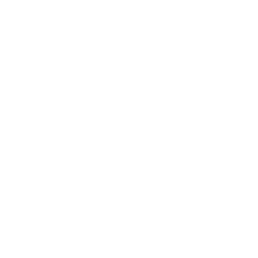

<p align="center">
  
</p>

## Description

This is our S8 project in partnership with Doctolib.

## Requirements

This application has been developped using version 18.16.1 LTS of nodeJS. 
The application is not guarenteed to work if the correct version is not used

## Installation

```bash
$ npm install
```
You will need to create a database called "docto-project" on your local machine if it does not already exist.

## Running the app

```bash
# database
$ docker-compose up

# development
$ npm run start

# watch mode
$ npm run start:dev

# production mode
$ npm run start:prod
```

## Test

```bash
# unit tests
$ npm run test

# e2e tests
$ npm run test:e2e

# test coverage
$ npm run test:cov
```


